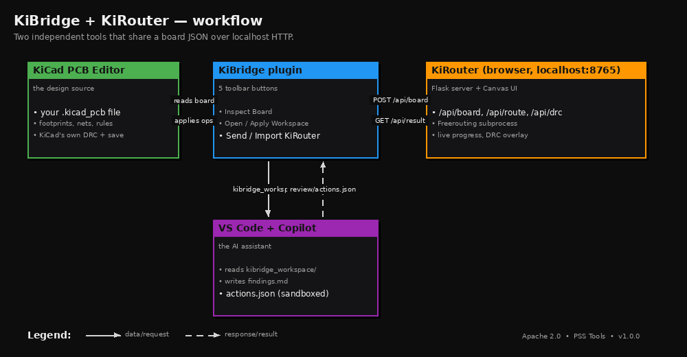
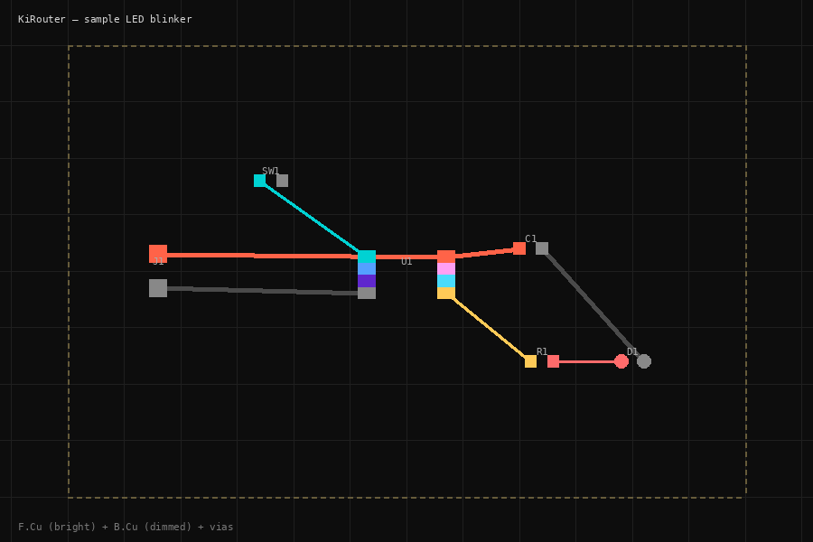

<div align="center">

# KiBridge &nbsp;&middot;&nbsp; KiRouter

If KiBridge helps your KiCad workflow, consider supporting the project on Ko-fi:

[Support me on Ko-fi](https://ko-fi.com/pss)

**Open-source AI-assisted PCB tooling for KiCad 10.**
A KiCad plugin and a companion local web-app autorouter — bridged over `localhost`.

[](https://github.com/IgmarMelis/kibridge/actions)
[](LICENSE)
[](https://www.kicad.org/)
[](https://www.python.org/)

</div>

---



KiBridge and KiRouter are two independent tools that share one board JSON over localhost HTTP. **KiBridge** is the KiCad plugin. **KiRouter** is a small Flask web app that visualizes the board, drives [Freerouting](https://github.com/freerouting/freerouting) for autorouting, and runs a fast first-pass DRC. Designs never leave your machine; the server refuses to bind anywhere but `127.0.0.1`.

The plugin also exposes a separate AI-assist workflow: it writes a `kibridge_workspace/` folder that Copilot reads, and applies Copilot's `actions.json` through an AST-sandboxed runner so the LLM can suggest changes but can't execute arbitrary code.

## What's in v1.0

**KiBridge plugin** — five toolbar buttons under the `PSS Tools` menu:

| Button | What it does |
|---|---|
| **KiBridge: Inspect Board** | Read-only board summary, JSON + TXT report. |
| **KiBridge: Open Workspace** | Generates `kibridge_workspace/snapshot/` for Copilot to read. |
| **KiBridge: Apply Workspace** | Validates and applies Copilot's `actions.json` (sandboxed). |
| **KiBridge: Send to KiRouter** | POSTs the current board to KiRouter at `localhost:8765`. |
| **KiBridge: Import from KiRouter** | Pulls the routed result, backs up the `.kicad_pcb`, applies tracks/vias. |

**KiRouter web app** — opens in your browser:



- HTML5 Canvas board viewer (pan / zoom / layer toggles / click-to-highlight nets)
- **Auto-route** button driving Freerouting as a subprocess (live progress, log tail, accept/discard)
- **Run DRC** button with 6 rules (track width, via diameter/drill, board outline, pad shorts, clearance) and red/yellow crosshair markers on the canvas
- API: `/api/board`, `/api/engines`, `/api/route`, `/api/route/status`, `/api/result`, `/api/result/accept`, `/api/drc`

## Quick start

### 1. Install the plugin

**Windows (one click):**
```cmd
INSTALL.bat
```

This wipes any legacy `pss_kicad_agent` install and copies `plugin/kibridge` to:

```
C:\Users\<you>\Documents\KiCad\10.0\scripting\plugins\kibridge\
```

Restart KiCad's PCB Editor — the five `KiBridge:` buttons appear in the toolbar.

**Manual:** copy `plugin/kibridge/` into your KiCad scripting/plugins folder. See [INSTALL.md](docs/INSTALL.md) for platform paths.

### 2. Start KiRouter

**Windows:** `cd router && START_KIROUTER.bat`
**macOS/Linux:** `cd router && ./start_kirouter.sh`

First run creates a `.venv/` and installs Flask (~3 seconds). Browser opens to `http://localhost:8765`. Click **Load Sample** to see the demo LED-blinker board.

### 3. Install Freerouting (one-time, only if you want auto-routing)

KiRouter without Freerouting still lets you visualize boards and run DRC. To enable **Auto-route**:

1. Install Java 17+ from [Adoptium Temurin](https://adoptium.net/temurin/releases/)
2. Download `freerouting-X.Y.Z.jar` from [Freerouting releases](https://github.com/freerouting/freerouting/releases)
3. Drop it into `router/kirouter/freerouting/bin/`

Full instructions and troubleshooting: [docs/freerouting.md](docs/freerouting.md).

### 4. Round-trip a real board

1. Open your `.kicad_pcb` in KiCad's PCB Editor
2. Click **KiBridge: Send to KiRouter** (toolbar)
3. Switch to your browser → click **Auto-route** → wait
4. Switch back to KiCad → click **KiBridge: Import from KiRouter**
5. Confirm the dialog → routes appear on your PCB
6. Press **Ctrl+S** to save

The plugin makes a timestamped backup (`kibridge_backup_YYYYMMDD_HHMMSS_<name>.kicad_pcb`) before modifying anything, so a bad routing session is one file-rename away from undo.

## Architecture

### Why two tools, not one?

The plugin runs inside KiCad's embedded Python and has to stay small, dependency-free (stdlib only), and crash-resistant — anything that crashes the plugin crashes the editor. The web app runs in its own Python process with Flask, threads, subprocess calls to Freerouting, and a rich Canvas UI. Splitting them keeps the plugin trivially safe and lets the web app evolve independently.

The two talk over `localhost:8765` HTTP with a stable JSON schema. The plugin only depends on the schema and the endpoint names; it doesn't know or care what's behind the server, so future routing engines (custom A*, AI-assisted, etc.) plug in without touching the plugin.

### Why local-only?

PCB designs are commercial IP. The server enforces this at the binding level — `kirouter --host 0.0.0.0` exits with code 2 before opening a socket. Every endpoint refuses anything but `127.0.0.1`. The plugin's HTTP client does the same check on the outbound side. Nothing leaves your machine unless you copy it yourself.

### Why subprocess Freerouting and not bundle it?

License hygiene. Freerouting is GPL v3, KiBridge is Apache 2.0. Calling Freerouting as a subprocess (no linking, no embedding) keeps the licenses cleanly separated. You install the JAR yourself, the way you'd install any external tool. The two-minute setup is documented in [docs/freerouting.md](docs/freerouting.md).

### Why JSON over HTTP and not WebSockets / IPC / shared memory?

This is a single-user, single-machine system. HTTP is universally available, easy to test (`curl`, browser dev tools), and trivially debuggable. WebSockets would buy us bidirectional push for routing progress, but polling at 700ms is indistinguishable from push for human-scale operations, and the simpler protocol is worth more than the latency savings.

## What KiBridge doesn't do

A few things we explicitly chose **not** to do — they're either out of scope, infeasible, or actively harmful:

- **AI autorouting.** LLMs can't do grid routing well. Token budgets won't fit a real netlist, spatial precision suffers, and DRC convergence is unreliable. Freerouting was built for this; we use it. The LLM's job is higher-level: pick a routing strategy, review the result, suggest changes to design rules or component placement.
- **Schematic editing.** KiBridge operates on the PCB only. The schematic is the source of truth for connectivity; we read it but don't try to round-trip-modify it.
- **Cloud sync.** No accounts, no telemetry, no analytics. The whole system runs offline (except when downloading Freerouting once).
- **One-click "fix my board" automation.** Every modification the plugin makes goes through the user — through the **Apply Workspace** dialog (for Copilot's suggestions, with a per-action diff preview) or the **Import from KiRouter** dialog (with backup + confirm). The user is always in the loop before a `.kicad_pcb` changes.

## Repository layout

```
kibridge/
├── plugin/kibridge/             # The KiCad ActionPlugin (Python, stdlib only)
│   ├── kirouter_client.py       # urllib HTTP client + apply_routes_to_board
│   ├── send_to_kirouter.py      # "Send to KiRouter" toolbar button
│   └── import_from_kirouter.py  # "Import from KiRouter" toolbar button
├── router/kirouter/             # The Flask web app
│   ├── server.py                # 11 endpoints
│   ├── freerouting/             # DSN export, SES parse, JAR runner
│   ├── router_engine/           # Engine abstraction, JobManager
│   ├── drc.py                   # 6-rule DRC
│   └── static/                  # Canvas UI (HTML/CSS/JS)
├── workspace_template/          # Template for kibridge_workspace/ Copilot folder
├── docs/                        # freerouting.md, workflow.png, sample_board.png
├── scripts/                     # render_sample.py, render_workflow.py
├── tests/                       # AST sandbox, plugin e2e, plugin↔KiRouter
├── INSTALL.bat / UNINSTALL.bat  # One-click Windows install
├── CHANGELOG.md
├── CONTRIBUTING.md
├── LICENSE                       # Apache 2.0
└── NOTICE
```

## Tests

Ten test phases run in CI on every push:

```bash
# Plugin
python tests/test_sandbox.py            # 22 AST sandbox cases
python tests/test_kibridge_e2e.py       # full workspace pipeline
python tests/test_kirouter_client.py    # plugin <-> server round-trip (41 cases)

# Router
python router/tests/test_server_roundtrip.py    # 30 cases — Stage 2 API
python router/tests/test_dsn_ses.py             # 25 cases — DSN+SES
python router/tests/test_drc.py                 # 17 cases — DRC rules
python router/tests/test_route_engine.py        # 28 cases — engine + JobManager
python router/tests/test_server_stage3.py       # 25 cases — Stage 3 endpoints
```

The Stage 3 and 4 tests use a fake Freerouting (no Java or JAR required), so the full suite runs in CI in seconds. Real Freerouting is only needed when you actually want to route boards.

## Contributing

PRs welcome — see [CONTRIBUTING.md](CONTRIBUTING.md). Things that would help most:

- Test on macOS and Linux (project is developed on Windows)
- More DRC rules (zone clearance, courtyard overlap, silkscreen-on-pad)
- A second routing engine (custom A* or wrap a different tool)
- Real-PCB feedback — open an issue with your board and what Freerouting did with it

## License

Apache 2.0 — see [LICENSE](LICENSE). KiCad is GPLv3; Freerouting is GPLv3; we link to neither and call them as separate processes only. Your boards are your IP.

— *Igmar Melis / PSS Tools*
